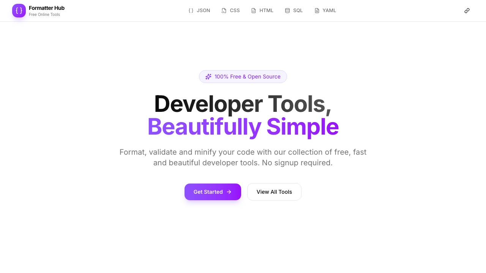

# Formatter Hub - Free Online Code Formatters

A beautiful collection of free developer tools to format, validate and minify code.




## 🚀 Live Demo

**🌐 Production:** https://formatterhub.vercel.app

## ✨ Available Tools

| Tool | Route | Description |
|------|-------|-------------|
| **JSON** | /json | Format, validate and minify JSON |
| **CSS** | /css | Beautify and minify CSS |
| **HTML** | /html | Prettify and compress HTML |
| **SQL** | /sql | Format SQL queries |
| **YAML** | /yaml | Parse and format YAML |

## 🎯 Features

### All Formatters Include:
- **Format** - Beautify code with proper indentation
- **Minify** - Compress code for production
- **Syntax Highlighting** - Easy-to-read colored output
- **Line Numbers** - Optional line number display
- **Dark/Light/System Mode** - Theme switching
- **Import/Export** - Load and save files
- **Copy to Clipboard** - One-click copy

### UI Features:
- Modern, clean interface
- Side-by-side input/output panels
- Responsive design
- Fast and lightweight

## 🛠️ Tech Stack

| Technology | Version | Purpose |
|------------|---------|---------|
| **Next.js** | 16.2.7 | React framework with App Router |
| **React** | 19 | UI library |
| **TypeScript** | 5 | Type safety |
| **Tailwind CSS** | v4 | Utility-first styling |
| **shadcn/ui** | v4 | UI component library |
| **Lucide React** | latest | Icon system |

## 📁 Project Structure

```
json-formatter/
├── src/
│   ├── app/
│   │   ├── page.tsx              # Landing page
│   │   ├── layout.tsx            # Root layout
│   │   ├── json/page.tsx         # JSON formatter
│   │   ├── css/page.tsx          # CSS formatter
│   │   ├── html/page.tsx         # HTML formatter
│   │   ├── sql/page.tsx           # SQL formatter
│   │   └── yaml/page.tsx          # YAML formatter
│   ├── components/
│   │   ├── navbar.tsx            # Navigation bar
│   │   ├── json-formatter.tsx    # JSON formatter component
│   │   ├── css-formatter.tsx     # CSS formatter component
│   │   ├── html-formatter.tsx    # HTML formatter component
│   │   ├── sql-formatter.tsx     # SQL formatter component
│   │   ├── yaml-formatter.tsx    # YAML formatter component
│   │   └── editor/               # Input/output components
│   ├── hooks/
│   │   └── use-local-storage.ts  # Persistent state
│   └── types/
│       └── formatter.ts           # TypeScript types
└── README.md
```

## 🚦 Getting Started

```bash
# Install dependencies
npm install

# Start development server
npm run dev

# Build for production
npm run build

# Run linter
npm run lint
```

## 💾 Data Storage

All settings are stored in browser's **localStorage**:
- `json-formatter-settings`
- `css-formatter-settings`
- `html-formatter-settings`
- `sql-formatter-settings`
- `yaml-formatter-settings`
- `formatter-hub-theme`

## 📄 License

MIT License - feel free to use and modify.

---

Built with ❤️ using Next.js, shadcn/ui, and Tailwind CSS
